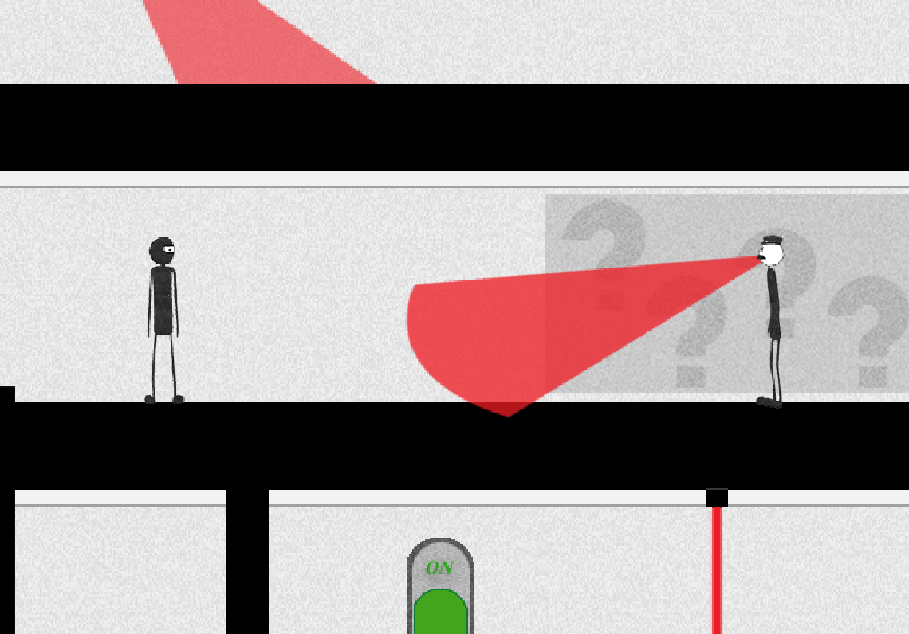

# Stealth Escape

**2D stealth platformer built with Java and libGDX — collect items, avoid detection, escape the level.**

SDP Group Project · 2nd Year · Desktop (Java)

<p align="center">
  
</p>

---

## Team

| Name | GitHub |
|------|--------|
| Yerkebulan Bissen | [@yerk0shh](https://github.com/yerk0shh) |
| Yernur Beisenbek | [@Takahashi0021](https://github.com/Takahashi0021) |
| Akgul Daulet | [@dauletovaakgul213-stack](https://github.com/dauletovaakgul213-stack) |

---

## About the Game

Stealth Escape is a 2D side-scrolling stealth platformer. The player infiltrates a guarded facility, collects all required items while avoiding guards, lasers, traps, and surveillance cameras, then escapes through the exit door.

- **Win:** Collect all items → reach the exit door
- **Lose:** Detected by a guard or camera, or touch a laser / trap

---

## Controls

| Key | Action |
|-----|--------|
| `A` / `←` | Move left |
| `D` / `→` | Move right |
| `W` / `↑` | Climb stairs up |
| `S` / `↓` | Climb stairs down |
| `H` | Hide / Unhide |
| `P` / `Esc` | Pause / Resume |
| `Enter` / `Space` | Continue from Game Over |

---

## How to Run

Download `desktop-1.0.jar` from [Releases](../../releases) and run:

```bash
java -jar desktop-1.0.jar
```

No installation needed.

---

## How to Build from Source

```bat
.\gradlew.bat clean
.\gradlew.bat desktop:dist
```

Output: `desktop/build/libs/desktop-1.0.jar`

---

## Project Structure

```
core/       — Game logic (player, enemies, screens, states)
desktop/    — Desktop launcher
assets/     — Sprites, texture atlases, animations
doc/        — UML class diagram, game flow, level sketch
screenshots/— Gameplay screenshots
GDD.pdf     — Game Design Document
TESTING.md  — Test checklist and bug log
```

---

## Design Patterns

| Pattern | Where | How |
|---------|-------|-----|
| **State Pattern** | `StateManager` + `State` | All screens (`MenuState`, `FirstLevel`, `PauseState`, `GameOverState`, `WinState`) extend abstract `State`. `StateManager` uses a stack — `push()` to open a screen, `pop()` to return. `GameManager` only calls `update()` and `render()` on the top state. |
| **Strategy Pattern** | `Guard` + `GuardPatrol` enum | Guard switches behavior at runtime via `guardAction`: `MoveLeft`, `MoveRight`, `CheckNoise`, `CheckArea`, `MoveToStartPoint`. When a `SoundWave` is detected, the guard changes strategy to `CheckNoise` and moves toward the sound source. |
| **Observer Pattern** | `TouchBlock` → `Guard` via shared `soundwaves` list | `TouchBlock` creates `SoundWave` objects and adds them to a shared list. `Guard` checks the same list every frame in `CheckCollisionWithSoundWaves()`. No direct reference between the two classes — they communicate only through the shared list. |
 
---

## SOLID Principles

| Principle | How it's applied |
|-----------|-----------------|
| **S** — Single Responsibility | `PlayerController` handles input only. `Player` handles state only. Separate classes, separate jobs. |
| **O** — Open / Closed | `State` is abstract. New screens extend it without modifying existing code. |
| **L** — Liskov Substitution | `StateManager.push(State)` accepts any `State` subclass interchangeably. |
| **I** — Interface Segregation | `Renderable` and `Updatable` are separate interfaces. `Guard` implements only `Renderable`; `Player` implements both. |
| **D** — Dependency Inversion | `GameManager` depends on the `State` abstraction via `StateManager`, not on concrete screen classes. |

---

## Documentation

| File | Description |
|------|-------------|
| `GDD.pdf` | Game Design Document |
| `TESTING.md` | Manual test checklist + bug log |
| `doc/classes.png` | UML Class Diagram |
| `doc/game-flow.png` | Game Flow Diagram |
| `doc/level-sketch.png` | Level Sketch |

---

## Known Issues

- Currently ships with one fully designed level; additional levels planned.
